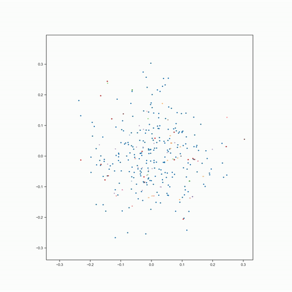

# 2D Tissue Reassembly with E(2)-Equivariant Graph Neural Cellular Automata

A PyTorch implementation of a cellular automata model that learns to reassemble 2D tissue patterns while respecting E(2) symmetries (translations, rotations, and reflections). The model combines Graph Neural Networks with Neural Cellular Automata to create a system that can reconstruct tissue patterns from scattered cells.

## Features
- E(2)-equivariant neural network architecture
- Graph-based cellular interactions
- Continuous space cellular automata
- Support for various tissue patterns and cell configurations

## Example visualization

Starting from random cell positions, the model learns to reassemble the original tissue pattern.



## Installation

We use uv for dependency management:

```bash
pip install uv
```

Now you can create the virtual environment by running the setup script:
```bash
bash setup_venv.sh
```

Run remotely:
```bash
kubectl exec -it statefulset-darius-a100-0 -- bash -c "cd /epyc/projects/dschaub/method-projects/spatialnca && exec bash"

uv run run.py --add_init=True --clip_value=1.0 --max_coord_upd_norm=0.05 --complete=True --pos_init_kwargs='{"scale": 0.05}' --kernel_fn=gaussian --kernel_kwargs='{"eps": 0.02, "max_radius": 0.05}' --use_attn=True --scale_by_dist=True --watch=True
```

